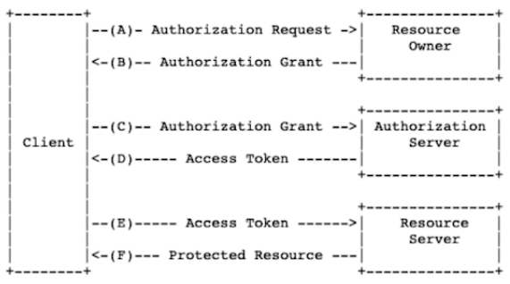
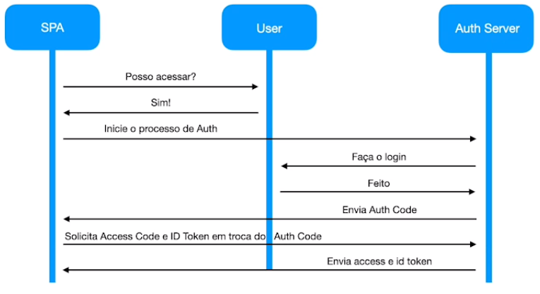

# Autenticação

O que você precisa entender sobre Autenticação e Autorização em ambientes distribuídos.

Exemplo:
- Wesley - Dono de uma conta bancária
- Mariana, esposa do Wesley
- Davi, gerente do banco
- Cartório
- Mariana chega no Davi, o gerente do banco e pede para realizar, em nome do Wesley, uma transferência.
- Davi responde: Você não pode fazer isso. Somente o Wesley ou quem o Wesley autorizar através de uma procuração.
- Mariana vai até o cartório junto com o Wesley e fazem uma procuração para que a Mariana consiga realizar transferencias bancárias no nome dele.
- Mariana chega no Davi, o gerente do banco e pede para realizar em nome do Wesley uma transferência. E para isso ela apresenta a procuração
- Davi pega a procuração, liga no cartório e verifica se a mesma realmente é válida
- Cartório confirma que a procuração é válida
- Davi fala para Mariana: A partir de agora, você poderá realizar transações em nome do Wesley

Wesley - dono da conta bancária => **Resource Owner**
Mariana - esposa do wesley => **Client**
Davi -  gerente do banco => **Resource Server**
Cartório => **Authorization Server**

### OAuth 2
"The OAuth 2.0 authorization framework enables a third-party application to obtain limited access to an HTTP service"
Framework de Autorização e NÃO de Autenticação

### OAuth 2 "Flow"


**Como aproveitar esse fluxo de trabalho com Autenticação/Login?**

### OpenID Connect
"OpenID Connect 1.0 is a simple identify layer on top of the OAuth 2.0 [RFC6749] protocol. It enables Clients to verify the identify of the End-User based on the authentication performed by an Authorization Server..."

### OpenID Connect "Flow"


- OAuth 2 Authorization Framework/RFC 6749
- RFC 6749 possui uma definição de uma API chamada: "authorization endpoint"
- Essa API necessita de um parâmetro "response_type"
- O OpenID Connect utiliza esse parâmetro para emitir o token para autenticação.
- Quando estamos utilizando apenas OAuth 2, esse parâmetro pode ser "code" ou "token"
- Ao utilizar OpenID Connect, um novo valor pode ser adicionado: "id_token"
- Juntamente ao "id_token", o valor openid pode ser passado como parte do escopo no fluxo do OAuth 2.

### Tipos de response_type
- code
- token
- id_token
- id_token_token
- code id_token
- code token
- code token id_token
- none

### O que é o id_token?
- Possui informações necessárias para garantir a autenticação do usuário, como ID, Email e informações adicionais passadas pelo servidor de autenticação.
- JWT (JSON Web Tokens)
- Padrão aberto que representa de forma segura solicitações de informação entre duas partes.
- Token é um código base64 que armazena um JSON
- JWT possui 3 partes:
  - HEADER
  - Payload
  - Signature

https://www.keycloak.org/

### Keycloak on Docker
``` bash
docker run -p 8080:8080 -e KEYCLOAK_USER=admin -e KEYCLOAK_PASSWORD=admin quay.io/keycloak/keycloak:15.0.2
```

